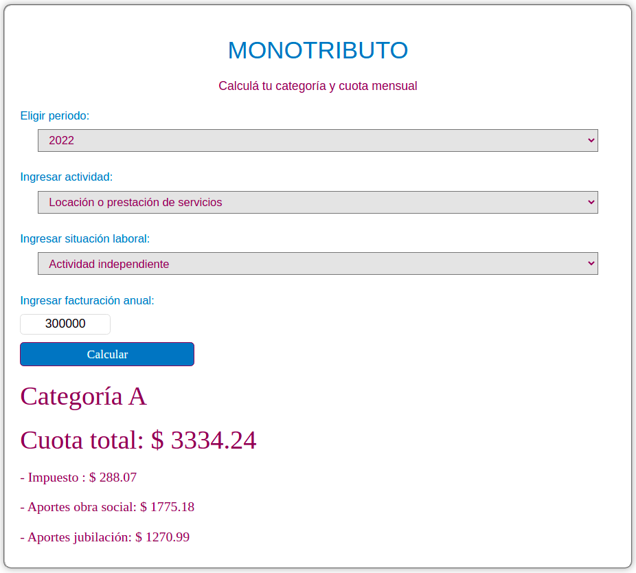

# Calculadora Monotributo

_Para leer en otros idiomas: [English](README.md), [Español](README.es.md)._

Esta es una simple calculadora hecha para el blog [Mi presupuesto familiar](https://www.presupuestofamiliar.com.ar/). Te devuelve la categoría en la que te encontrás en el monotributo y cuanto tenés que pagar de impuestos, dependiendo de tu ingreso anual.

Para más información sobre la categoría y cuanto hay que pagar, [mirá este artículo del blog](https://www.presupuestofamiliar.com.ar/monotributo-2022-categorias-aportes-cuota-mensual/).

Estoy hosteando esta calculadora en Github pages, podes probarla [acá](https://joaquinfeltes.github.io/Calculadora_Monotributo/).

### Un ejemplo de la calculadora en uso:

## 
