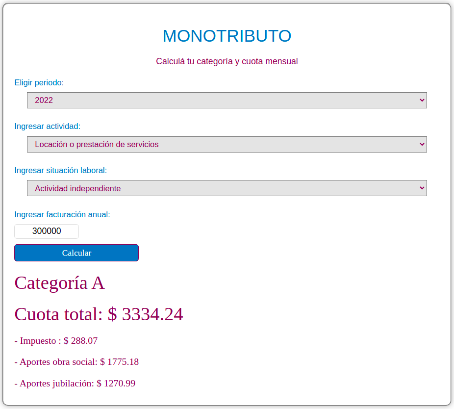

# Monotax Calculator

_Read this in other languages: [English](README.md), [Español](README.es.md)._

This is a simple calculator done for embedding in the blog [Mi presupuesto familiar](https://www.presupuestofamiliar.com.ar/). It gives you your monotax category and how much taxes you have to pay monthly depending on your annual bill.

For more information on why you get each category and how much you have to pay, check [this article in the blog](https://www.presupuestofamiliar.com.ar/monotributo-2022-categorias-aportes-cuota-mensual/).

I'm hosting the calculator in Github pages, check it out [here](https://joaquinfeltes.github.io/Calculadora_Monotributo/).

### Here's an example of the calculator working:

## 
